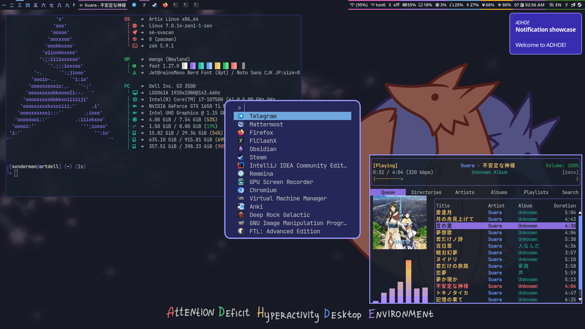

<div align="center">

# ADHDE dotfiles

_Attention Deficit Hyperactivity Desktop Environment_

</div>

My personal dotfiles and configs for various linux software that together form [ADHDE](https://github.com/Senderman/adhde) - **Attention Deficit Hyperactivity Desktop Environment** (the manual is currently a WIP and has not yet been translated).

---



---

# Software used

The table is incomplete

|                           |                                                                             |
| ------------------------- | --------------------------------------------------------------------------- |
| **OS**                    | [Artix Linux](https://artixlinux.org)                                       |
| **WM**                    | [MangoWM](https://mangowm.github.io)                                        |
| **Status bar**            | [Waybar](https://github.com/Alexays/Waybar)                                 |
| **Shell**                 | [Zsh](https://www.zsh.org)                                                  |
| **Terminal**              | [Foot](https://codeberg.org/dnkl/foot)                                      |
| **Text Editor**           | [Neovim](https://neovim.io)                                                 |
| **Fonts**                 | [JetBrainsMono Nerd Font](https://www.nerdfonts.com), Noto Sans CJK JP      |
| **File manager**          | [Yazi](https://yazi-rs.github.io)                                           |
| **Launcher**              | [Fuzzel](https://codeberg.org/dnkl/fuzzel)                                  |
| **Music Player**          | MPD+[RMPC](https://rmpc.mierak.dev)                                         |
| **Screenshot annotation** | [Satty](https://github.com/Satty-org/Satty)                                 |
| **Process supervision**   | [s6/s6-rc stack](https://skarnet.org/software)                              |

# Installation
This repo is designed to be used with [GNU Stow](https://www.gnu.org/software/stow/).

To learn how to manage dotfiles using stow, read [this article written by Alex Pearwin](https://alexpearce.me/2016/02/managing-dotfiles-with-stow).

But here's quick start:

```
cd ~ # you should clone the repo to the $HOME directory because this is how stow works
git clone https://github.com/Senderman/dotfiles.git
cd dotfiles
stow mangowm
```

This will symlink `~/dotfiles/mangowm/*` to `$HOME` . Since you probably already have `~/.config` directory, you will get `~/.config/mangowm` directory which is symlink to `~/dotfiles/mangowm/.config/mango`:

```bash
~ $ readlink ~/.config/mango
../dotfiles/mangowm/.config/mango
```

if you want to uninstall symlink, run `stow -D mangowm`. Don't worry, this will never delete files that don't belong to this repository.

You're welcome to fork this repo, edit the dotfiles and add your own and create PR if you want to make ADHDE better or to suggest a new software and its configs :)

# Move your config files to the dotfiles repository

This repository contains a script called [stowlink](scripts/.local/scripts/stowlink) which can help you to move your configuration files to the dotfiles repository in one command.

E.g. if you want to move and symlink your waybar config to the dotfiles repository, all you need to do is simply run 

```bash
stowlink .config/waybar waybar
```

Many thanks to my dear friend [Vezono](https://github.com/vezono) for this script!

